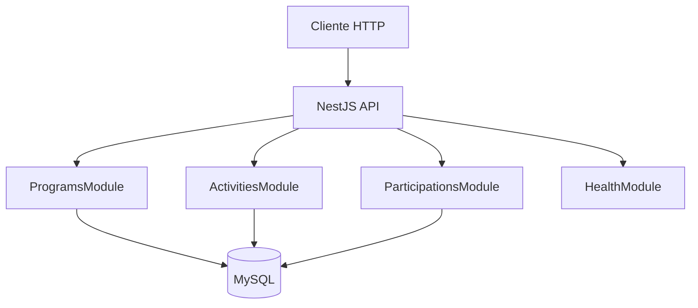

# Namu Wellness API — Documentação Técnica

## Visão geral

API REST desenvolvida com **NestJS**, **TypeScript**, **TypeORM** e **MySQL** para gerenciar programas de bem-estar, atividades vinculadas e participações dos usuários.

Documentação interativa disponível em: `GET /api/docs` (Swagger UI).

---

## Arquitetura



### Módulos

| Módulo | Responsabilidade |
|--------|------------------|
| `ProgramsModule` | CRUD de programas e relatório `/summary` |
| `ActivitiesModule` | CRUD de atividades por programa |
| `ParticipationsModule` | Registro e listagem de participações |
| `HealthModule` | Health check da aplicação |
| `DatabaseModule` | Conexão TypeORM e entidades |

### Camadas por feature

Cada domínio segue a estrutura:

- **Controller** — rotas HTTP e contratos Swagger
- **Service** — regras de negócio
- **DTO** — validação (`class-validator`) e documentação
- **Mapper** — transformação entidade → resposta da API
- **Entity** — mapeamento TypeORM

---

## Modelo de dados

### `programs`

| Campo | Tipo | Descrição |
|-------|------|-----------|
| id | INT | PK auto increment |
| name | VARCHAR(255) | Nome do programa |
| description | TEXT | Descrição opcional |
| category | ENUM | `meditação`, `exercício`, `nutrição` |
| duration_weeks | INT | Duração em semanas |
| created_at | TIMESTAMP | Criação |
| updated_at | TIMESTAMP | Atualização |

### `activities`

| Campo | Tipo | Descrição |
|-------|------|-----------|
| id | INT | PK |
| program_id | INT | FK → programs |
| title | VARCHAR(255) | Título |
| description | TEXT | Opcional |
| day_of_week | ENUM | Dia da semana (pt-BR) |
| duration_minutes | INT | Duração |

### `participations`

| Campo | Tipo | Descrição |
|-------|------|-----------|
| id | INT | PK |
| user_name | VARCHAR(255) | Nome do participante |
| activity_id | INT | FK → activities |
| completed_at | TIMESTAMP | Data/hora da conclusão |
| notes | TEXT | Observações opcionais |

Relacionamentos com `ON DELETE CASCADE`: ao remover um programa, suas atividades e participações vinculadas são removidas em cascata.

---

## Endpoints

### Health

| Método | Rota | Descrição |
|--------|------|-----------|
| GET | `/health` | Status da API |

### Programas — `/programs`

| Método | Rota | Descrição |
|--------|------|-----------|
| POST | `/programs` | Criar programa |
| GET | `/programs?page&limit` | Listar com paginação |
| GET | `/programs/:id` | Buscar por ID |
| PATCH | `/programs/:id` | Atualizar |
| DELETE | `/programs/:id` | Remover |
| GET | `/programs/:programId/summary` | Relatório do programa |

**Exemplo — criar programa**

```json
POST /programs
{
  "name": "Yoga Matinal",
  "description": "Sequências para começar o dia",
  "category": "exercício",
  "duration_weeks": 8
}
```

**Exemplo — relatório**

```json
GET /programs/1/summary
{
  "program_id": 1,
  "total_activities": 2,
  "total_participations": 3,
  "top_participants": [
    { "user_name": "Ana Silva", "participation_count": 2 },
    { "user_name": "Carlos Santos", "participation_count": 1 }
  ]
}
```

A query do relatório usa `QueryBuilder` com `JOIN`, `GROUP BY`, `ORDER BY` e `LIMIT 5` para os participantes mais ativos.

### Atividades — `/programs/:programId/activities`

| Método | Rota | Descrição |
|--------|------|-----------|
| POST | `.../activities` | Criar atividade |
| GET | `.../activities?page&limit` | Listar |
| GET | `.../activities/:activityId` | Detalhe |
| PATCH | `.../activities/:activityId` | Atualizar |
| DELETE | `.../activities/:activityId` | Remover |

### Participações — `/participations`

| Método | Rota | Descrição |
|--------|------|-----------|
| POST | `/participations` | Registrar conclusão |
| GET | `/participations?page&limit` | Listar |
| GET | `/participations/:id` | Detalhe |

**Exemplo — registrar participação**

```json
POST /participations
{
  "user_name": "Ana Silva",
  "activity_id": 1,
  "completed_at": "2025-01-15T08:00:00.000Z",
  "notes": "Primeira sessão"
}
```

---

## Validação e erros

- **ValidationPipe** global com `whitelist` e `forbidNonWhitelisted`
- Campos inválidos retornam `400 Bad Request` com lista de mensagens
- Recursos inexistentes retornam `404 Not Found`
- Erros não tratados retornam `500` com payload padronizado:

```json
{
  "statusCode": 404,
  "error": "Not Found",
  "message": "Program with id 99 not found",
  "path": "/programs/99",
  "timestamp": "2025-05-21T12:00:00.000Z"
}
```

---

## Paginação

Query params em listagens:

- `page` (padrão: 1)
- `limit` (padrão: 10, máximo: 100)

Resposta:

```json
{
  "data": [],
  "meta": {
    "total": 25,
    "page": 1,
    "limit": 10,
    "totalPages": 3
  }
}
```

---

## Migrations

```bash
npm run migration:run
npm run migration:revert
npm run migration:generate --name=NomeDaMigration
```

Arquivo de configuração: `src/database/typeorm.config.ts`

---

## Testes

| Tipo | Comando | Escopo |
|------|---------|--------|
| Unitário | `npm test` | Regras de negócio (summary, validação de activity) |
| E2E | `npm run test:e2e` | Health, listagem, validação e summary com banco real |

---

## Decisões técnicas

1. **NestJS modular** — separação por domínio facilita manutenção e testes.
2. **TypeORM migrations** — schema versionado; `synchronize: false` em produção.
3. **DTOs com snake_case na API** — alinhado ao contrato do teste e ao seed SQL.
4. **Mappers explícitos** — desacopla entidades ORM (camelCase) da resposta HTTP.
5. **Swagger em `/api/docs`** — documentação viva para avaliação e integração.

---

## Melhorias futuras

- Autenticação JWT para multi-tenant
- Filtros por categoria e período no relatório
- Cache Redis para endpoints de leitura
- Observabilidade com OpenTelemetry
